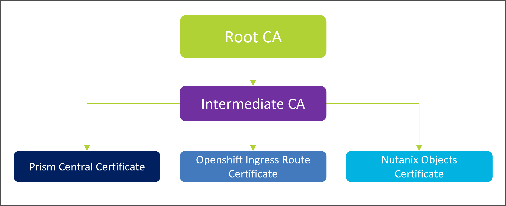

# Before install Openshift

## Openshift Minimum Requirements

### Openshift Resources

The following tables describe the minimum requirements to deploy an Openshift Cluster.

#### Bootstrap VM

| Nodes | CPU | Memory | Disk Size | vNic |
| ----- | --- | ------ | --------- | ---- |
|   1   |  4  |    16  |   160 Gb  |   1  |

#### Control Plane Nodes

| Nodes | CPU | Memory | Disk Size | vNic |
| ----- | --- | ------ | --------- | ---- |
|   3   |  4  |    16  |   160 Gb  |   1  |

#### Compute Nodes

| Nodes | CPU | Memory | Disk Size | vNic |
| ----- | --- | ------ | --------- | ---- |
|   2   |  8  |    8  |   160 Gb  |   1  |

#### Infrastructure Nodes

| Nodes | CPU | Memory | Disk Size | vNic |
| ----- | --- | ------ | --------- | ---- |
|   3   |  8  |    8  |   160 Gb  |   1  |

As minimum the Nutanix cluster must have the following resources available to deploy an Openshift Cluster

    - vCPU: 24 vCPU
    - Memory: 104 Gb
    - Storage: 1440 Gb

CPU overcommit or Memory overcommit must not be enabled on the Virtual Machine which host any Openshift Role (Control Plane, Infrastructure or Compute node). Compute resources must be managed through Resource Requests and Limits by Openshift Cluster.

Every Virtual Machine which host any Openshift Role (Control Plane, Infrastructure or Compute node) must be deployed on the same Nutanix Cluster and also on the same Nutanix AHV IPAM network. Deploy Openshift Virtual Machines on several networks is not supported at deployment time.

### Openshift IP allocation

For each Openshift Cluster, the following IPs are required:

    - One IP for Control Plane VIP
    - One IP for Ingress Route VIP
    - One IP for Bootstrap VM
    - Three IPs for Control Plane Nodes
    - One IP for each Compute node to be deployed
    - One IP for each Infrastructure node to be deployed

Based on the minimum nodes required to deploy an Openshift Cluster, Ten (10) is the minimum amount of IPs required.

### Internet Access

To perform an online install, the following internet URLs should be reachable:

    From Prism Central
    - rhcosredirector.apps.art.xq1c.p1.openshiftapps.com

    From Openshift Network
    - mirror.openshift.com
    - registry.redhat.io
    - registry.connect.redhat.com
    - quay.io

## Nutanix Requirements

Latest compability matrix is available at:

    https://portal.nutanix.com/page/documents/compatibility-interoperability-matrix/software?partnerName=Red%20Hat&solutionType=all&componentVersion=all&hypervisor=all&validationType=all

### Certificate Requirements

Openshift installer requires certificate trust between Prism Central and the binary it self. By default, the default self signed certificate in Prism Central, doesn´t include any DNS or IP subject alternative name, by this, this certificate must be replaced by one certificate which include the Prism Central DNS name.

Customers have two options:

1. Retrieve a certificate from a Public CA
2. Generate the new certificate from their internal CA.

When the second option is choosen, customers have to plan their certificate strategy carefully. The minimum amount of certificates to be created by the internal Certification Authority is three:

- Certificate for Prism Central
- Certificate for Nutanix Objects
- Certificate for default Ingress Route.

To keep your certificates trusted between several components involved on the installation, it is recommended every certificate is generated from the same Root Certification Authority.

At creation time, the maximum size for the RSA key must be **2048**.

The following certificates files must be created by the customer and should be provided with PEM format without passphrase:

    - Root CA certificate
    - Intermediate/issuing CA certificate (if exists)
    - Prism Central certificate
    - Prism Central certificate key
    - Ingresss Route certificate
    - Ingress Route certificate Key
    - Nutanix Objects certificate
    - Nutanix Objects certificate key

About Openshift Control Plane, certificates are managed by Openshift, so no further action is required.

### Storage Container

As minimum one Storage container is required to configure the Nutanix CSI. The criteria to associate Nutanix storage containers with Openshift Storage Classes is based on the Storage Container Capabilities.

If your Openshift Applications require for example only Compression at Nutanix level, one Storage Container with compression option enables is required. If at the same time your applications require Erasure Coding, an additional Storage Container is required. As summary, for each Storage Class defined with specific Nutanix capabilities requirements on Openshift, a Nutanix Storage Storage container must be created.

As an example

Storage Container with Compression = Storage Class 1
Storage Container with Compression and Erasure Coding = Storage Class 2

In addition, dedicated Storage Container for each Openshift Cluster are recommended, as there is no way from the infrastructure side to control the amount of the storage consumed by Openshift. By this, once the Storage Container is created, configure the desired adverstise capacity  to control how many storage is dedicated to Openshift Cluster

### IPAM Network

Every Openshift deployment requires a single AHV IPAM network, where every Openshift component should be deployed on it. You must size the AHV IPAM network to support every Openshift component.

In addition, VIP adresses for Control Plan and Ingress VIP address should be on the same network than the Virtual MAchine components but outside of the IP pool defined in the AHV network configuration.

As a note, several Openshift clusters might be placed in the same AHV IPAM network.

### Firewall Rules

## Helper VM

While Openshift installer might run on any client OS (Linux, Windows, MacOS) We strongly recommend to deploy a Linux Virtual Machine on the same network as the Openshift Cluster is going to be deployed. Some required binaries required to run the installation support Linux only (ccoctl, Cloud Credential Operator). This Virtual Machine is in charge of validate the network connectivity, firewall rules and internet access before deploy Openshift.

This guide has been tested on Ubuntu 20.04 and Ubuntu 22.04 with following resources

vCPU | Memory (Mb) | Local disk Size (Gb) |
---- | ----------- | -------------------- |
2    | 4096        | 40                   |
