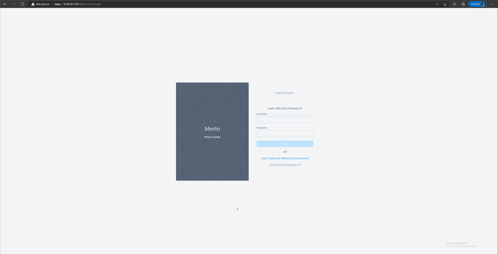

# Configure Nutanix Components

## Configure Nutanix Cluster

### Create dedicated storage container

1. Login into Prism Element UI
2. Open storage tab
3. Click on Storage container tab
4. Select required properties
5. Create

### Create Nutanix AHV IPAM network

1. Login into Prism Element UI
2. Go to settings
3. Click on Network Settings
4. Click on Create subnet
5. Fill the required information based on design

Once the network is created retrieve the network UUID

1. Login into Prism Element UI
2. Go to settings
3. Click on Network Settings
4. Select the previously created network and click on edit
5. Copy the Network UUID

### Get Nutanix Cluster UUID

1. Login into Prism Element UI
2. Click on the cluster name
3. Copy the Cluster UUID

### Configure Openshift service account

1. Login into Prism Element UI
2. Go to settings
3. Click on Role Mapping
4. Create Mapping for the Openshift user which includes Udear Admin and Cluster Admin roles

Once created, try to login with Openshift service account credentials

## Configure Prism Central

### Configure Openshift service account

1. Login into Prism Element UI
2. Go to settings
3. Click on Role Mapping
4. Create Mapping for the Openshift user which includes Udear Admin and Cluster Admin roles

Once created, try to login with Openshift service account credentials

### Configure certificates

1. Login into Prism Central
2. Go to settings
3. Click SSL certificates
4. Fill the required information

Once the process is finished, confirm the browser shows the new certificate

