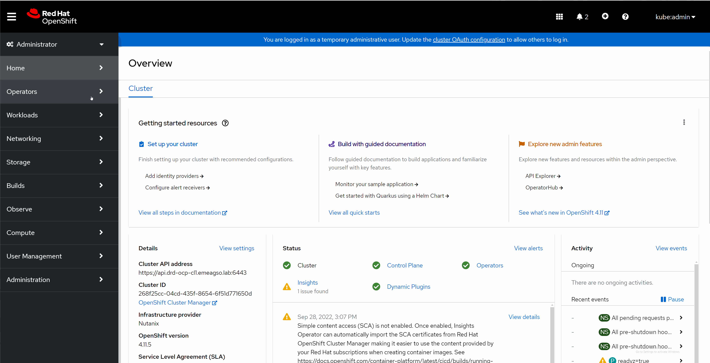

# Configure Nutanix CSI

## Configure the iscsi service on Openshift nodes

Apply the following configuration file

```yaml
apiVersion: machineconfiguration.openshift.io/v1
kind: MachineConfig
metadata:
  labels:
    machineconfiguration.openshift.io/role: worker
  name: 99-custom-enable-iscsid-worker
spec:
  config:
    ignition:
      version: 3.2.0
    systemd:
      units:
      - enabled: true
        name: iscsid.service
```

Wait till the Machine Operatoe shows updates status true

## Deploy the Nutanix CSI operator

1. Click on Operator Hub
2. Search by Nutanix
3. Deploy the Operator
4. Create a new namespace for Nutanix Operator called ntnx-system
5. Wait till Operator is deployed
6. Deploy One NutanixCSiInstance



7. Configure the Nutanix CSI secret

```yaml
apiVersion: v1
kind: Secret
metadata:
  name: ntnx-secret
  namespace: ntnx-system
stringData:
  # prism-ip:prism-port:username:password.
  key: <Prism Element Ip>:<Openshift Service Account>:<Openshift Service Account Password>
```

8. Configure Volumes Storage Class

```yaml
kind: StorageClass
apiVersion: storage.k8s.io/v1
metadata:
  name: general-1-std
  annotations:
    storageclass.kubernetes.io/is-default-class: "true"
provisioner: csi.nutanix.com
parameters:
  csi.storage.k8s.io/provisioner-secret-name: ntnx-secret
  csi.storage.k8s.io/provisioner-secret-namespace: ntnx-system
  csi.storage.k8s.io/node-publish-secret-name: ntnx-secret
  csi.storage.k8s.io/node-publish-secret-namespace: ntnx-system
  csi.storage.k8s.io/controller-expand-secret-name: ntnx-secret
  csi.storage.k8s.io/controller-expand-secret-namespace: ntnx-system
  csi.storage.k8s.io/fstype: ext4
  storageContainer: <Nutanix Storage Container>
  storageType: NutanixVolumes
  #description: "description added to each storage object created by the driver"
  #isSegmentedIscsiNetwork: "false"
  whitelistIPMode: ENABLED
  chapAuth: ENABLED
  #isLVMVolume: "false"
  #numLVMDisks: 4
allowVolumeExpansion: true
reclaimPolicy: Delete
```

9. Configure Files Storage Class
```yaml
kind: StorageClass
apiVersion: storage.k8s.io/v1
metadata:
  name: nutanix-dynfiles
provisioner: csi.nutanix.com
parameters:
  dynamicProv: ENABLED
  nfsServerName: <Nutanix Files Server Name>
  csi.storage.k8s.io/provisioner-secret-name: ntnx-secret
  csi.storage.k8s.io/provisioner-secret-namespace: ntnx-system
  csi.storage.k8s.io/node-publish-secret-name: ntnx-secret
  csi.storage.k8s.io/node-publish-secret-namespace: ntnx-system
  csi.storage.k8s.io/controller-expand-secret-name: ntnx-secret
  csi.storage.k8s.io/controller-expand-secret-namespace: ntnx-system
  storageType: NutanixFiles
  #description: "description added to each storage object created by the driver"
allowVolumeExpansion: true
```