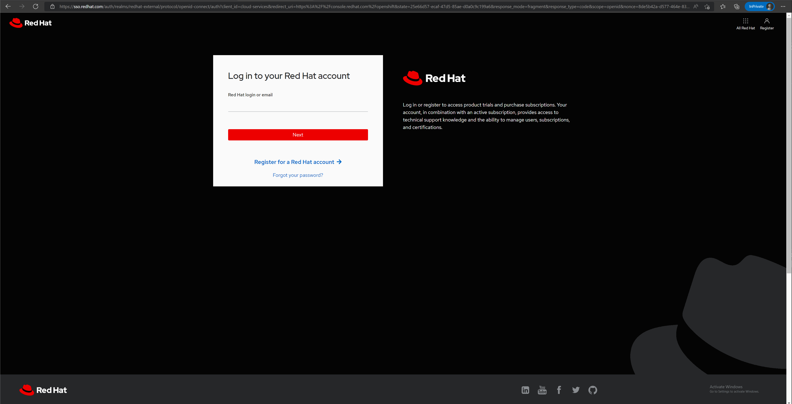
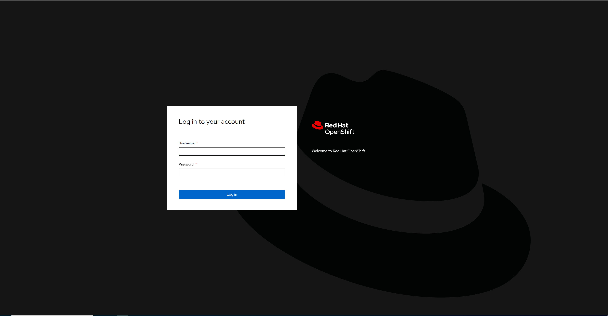

# Standard Openshift IPI install

## Prepare Client Machine

### Retrieve pull secret

From https://console.redhat.com/openshift



### Download required binaries

``` bash
{
sudo wget https://mirror.openshift.com/pub/openshift-v4/x86_64/clients/ocp/stable/openshift-install-linux.tar.gz
sudo tar -xvf openshift-install-linux.tar.gz
##Configure CCO
sudo wget https://mirror.openshift.com/pub/openshift-v4/x86_64/clients/ocp/stable/ccoctl-linux.tar.gz
sudo tar -xvf ccoctl-linux.tar.gz
##Download OC Client
sudo wget https://mirror.openshift.com/pub/openshift-v4/x86_64/clients/ocp/stable/openshift-client-linux.tar.gz
sudo tar -xvf openshift-client-linux.tar.gz
##Remove Downloads
sudo rm -r *.gz
##Move Binaries
sudo mv ccoctl openshift-install oc kubectl /usr/local/bin
}
```

### Define the following variables

``` bash
PROJECT_NAME=<openshift cluster name>
NX_PC_IP="<nutanix Prism Central fqdn name>"
NX_PC_USER="<Openshift service account>"
NX_PC_PASS="<Openshift service account passowrd>"
NX_PE_NAME='<Nutanix Prism Element Cluster Name>' # this
NX_PE_IP="10.1.1.20" # this
NX_PE_UUID='000582c6-cf0d-e0a8-0000-000000016950' # this
NX_PE_NETWORK="7e6bfe2f-4433-40d3-a337-893d7131ab87" # this
OC_CP_VIP="<Openshift Control Plane Virtual IP>"
OC_IS_VIP="<Openshift Ingress Controller Virtual Ip>"
OC_SERVICE_NETWORK='<Openshift service network>'
OC_POD_NETWORK='Openshift Pod Network'
OC_SECRET='<put your pull secret here>'
OC_CP_CPU='<Control Plane CPU per node>'
OC_CP_MEM='<Control Plane Memory per node>'
OC_CP_LOCAL_DISK_SIZE='<Control Plane Disk per node>'
OC_WORKER_COUNT=<Amount of worker nodes>
OC_WORKER_CPU='<Worker CPU per node>'
OC_WORKER_MEM='<Worker Memory per node>'
OC_WORKER_LOCAL_DISK_SIZE='<Worker Disk per node>'
DOMAIN='sample.es'
NX_PC_CA='<your ca certificate here>'
```

### Create the folder structure

``` bash
{
mkdir $PROJECT_NAME
mkdir $PROJECT_NAME/credentials
mkdir $PROJECT_NAME/credrequests
mkdir $PROJECT_NAME/credoutput
mkdir $PROJECT_NAME/bck
}
```

### Create SSH Keys for OCP nodes

``` bash
mkdir $PROJECT_NAME/sshkey
ssh-keygen -t rsa -b 4096 -f $PROJECT_NAME/sshkey/id_rsa -N ""
SSH_PUB=$(cat $PROJECT_NAME/sshkey/id_rsa.pub)
```

### Download CA certs from PC

``` bash
openssl s_client -showcerts -verify 5 -connect $NX_PC_IP:9440 < /dev/null |
   awk '/BEGIN CERTIFICATE/,/END CERTIFICATE/{ if(/BEGIN CERTIFICATE/){a++}; out="cert"a".crt"; print >out}'
sudo cp cert* /usr/local/share/ca-certificates
sudo update-ca-certificates
```

### Create the install-config.yaml

``` bash
#Create install Files
cat > $PROJECT_NAME/install-config.yaml <<EOF
apiVersion: v1
baseDomain: $DOMAIN
credentialsMode: Manual
additionalTrustBundle: | $NX_PC_CA
compute:
- architecture: amd64
  hyperthreading: Enabled
  name: worker
  platform:
    nutanix: 
      cpus: $OC_WORKER_CPU
      coresPerSocket: 1
      memoryMiB: $OC_WORKER_MEM
      osDisk:
        diskSizeGiB: $OC_WORKER_LOCAL_DISK_SIZE
  replicas: $OC_WORKER_COUNT
controlPlane:
  architecture: amd64
  hyperthreading: Enabled
  name: master
  platform:
    nutanix: 
      cpus: $OC_CP_CPU
      coresPerSocket: 1
      memoryMiB: $OC_CP_MEM
      osDisk:
        diskSizeGiB: $OC_CP_LOCAL_DISK_SIZE
  replicas: 3
metadata:
  name: $PROJECT_NAME
networking:
  clusterNetwork:
  - cidr: $OC_POD_NETWORK
    hostPrefix: 24
  machineNetwork:
  - cidr: 10.68.204.0/24
  networkType: OpenShiftSDN
  serviceNetwork:
  - $OC_SERVICE_NETWORK
platform:
  nutanix:
    apiVIP: $OC_CP_VIP
    ingressVIP: $OC_IS_VIP
    prismCentral:
      endpoint:
        address: $NX_PC_IP
        port: 9440
      password: $NX_PC_PASS
      username: $NX_PC_USER
    prismElements:
    - endpoint:
        address: $NX_PE_IP
        port: 9440
      uuid: $NX_PE_UUID
    subnetUUIDs:
    - $NX_PE_NETWORK
publish: External
pullSecret: '$OC_SECRET'
sshKey: $SSH_PUB
EOF
```

### Create the credentials files

``` bash
cat > $PROJECT_NAME/credentials/credentials.yaml <<EOF
credentials:
- type: basic_auth 
  data:
    prismCentral: 
      username: $NX_PC_USER
      password: $NX_PC_PASS
    prismElements: 
    - name: $NX_PE_NAME
      username: $NX_PC_USER
      password: $NX_PC_PASS
EOF
```

### Create the cloud credentials template

``` bash
cat > $PROJECT_NAME/credrequests/credrequests.yaml <<EOF
apiVersion: cloudcredential.openshift.io/v1
kind: CredentialsRequest
metadata:
  annotations:
    include.release.openshift.io/self-managed-high-availability: "true"
  labels:
    controller-tools.k8s.io: "1.0"
  name: openshift-machine-api-nutanix
  namespace: openshift-cloud-credential-operator
spec:
  providerSpec:
    apiVersion: cloudcredential.openshift.io/v1
    kind: NutanixProviderSpec
  secretRef:
    name: nutanix-credentials
    namespace: openshift-machine-api
EOF
```

### Create cloud credentials secret

``` bash
sudo ccoctl nutanix create-shared-secrets \
--credentials-requests-dir=$PROJECT_NAME/credrequests/ \
--output-dir=$PROJECT_NAME/credoutput \
--credentials-source-filepath=$PROJECT_NAME/credentials/credentials.yaml
```

### Generate install manifest and backup files

``` bash
cp $PROJECT_NAME/install-config.yaml $PROJECT_NAME/bck/
openshift-install create manifests --dir $PROJECT_NAME
cp -r $PROJECT_NAME/credoutput/manifests/*credentials.yaml $PROJECT_NAME/manifests
```

### Configure Openshift Proxy

``` bash
cat > $PROJECT_NAME/manifests/cluster-proxy-01-config.yaml <<EOF
apiVersion: config.openshift.io/v1
kind: Proxy
metadata:
  creationTimestamp: null
  name: cluster
spec:
  trustedCA:
    name: "user-ca-bundle"
EOF
```

## Install Openshift

``` bash
openshift-install create cluster --dir $PROJECT_NAME --log-level=debug
```


Once cluster is deployed UI console should be available at https://console-openshift-console.apps.<cluster name>.<domain name>



kubeconfig is available at:

  export KUBECONFIG=$(pwd)/$PROJECT_NAME/auth/kubeconfig

kubeadmin credentials are available at:

  $PROJECT_NAME/auth/kubeadmin-password